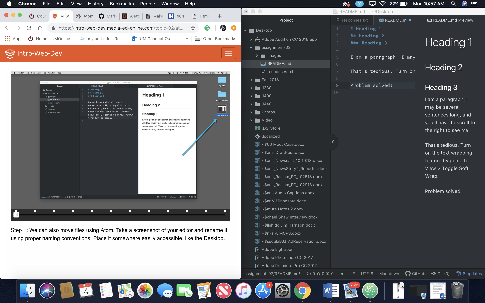

# Assignment 2

I decided to take this class to better understand web-development and make myself a more diverse internet journalist.
1. I learned that, although the language is different, the basic structure of the internet is fairly simple.
2. I hope to learn more about design and how to build efficient websites.
3. I also hope to learn enough to one day run my own freelance journalism website.

[Course Website](https://intro-web-dev.media-ed-online.com)

[My Responses](./responses.txt)

